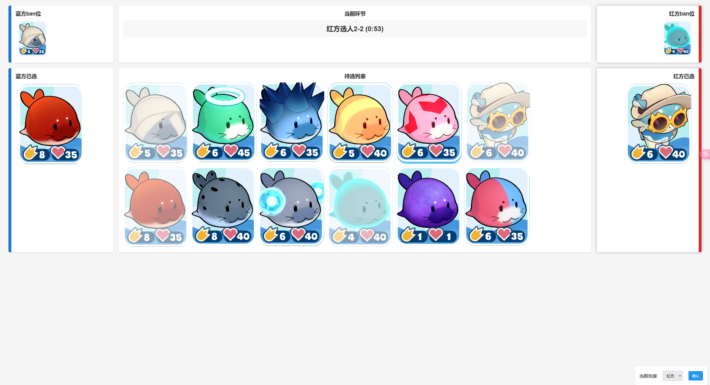
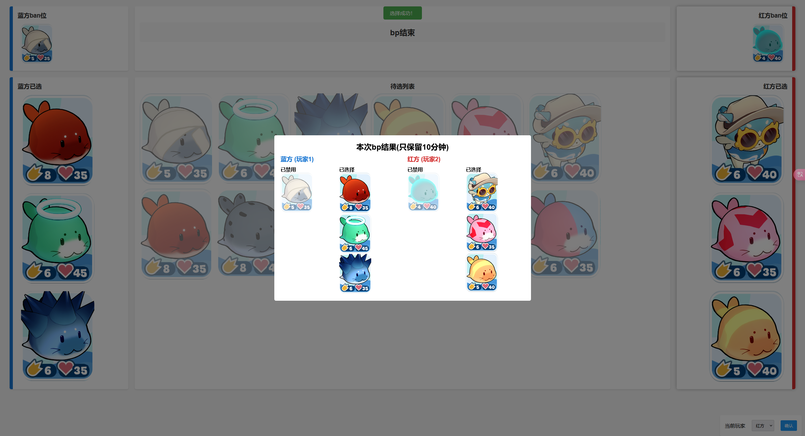

# BanPickSys-web

> 不会前端, 小孩子不懂事写着玩的





## 项目介绍

这是一个为星铁 - 豹豹碰碰大作战设计的 BP 系统前端, 该应用允许玩家在计时环境中轮流禁用和选择角色

## 功能特点

- **双方对战**：蓝方（玩家1）和红方（玩家2）
- **角色选择**：按回合顺序进行ban和pick (具体规则取决于后端)
- **阶段计时**：显示当前阶段和剩余时间
- **结果展示**：在游戏结束时显示最终选择

## 使用方法

参考 `BanPickSys` 使用方法

## API接口

- `/game` - 启动一场新 bp (GET)
- `/game/{gameId}` - 进入指定 bp 场次 (GET)
- `/game/{gameId}/status` - 获取当前游戏状态
- `/game/{gameId}/entries` - 获取可选角色列表
- `/game/{gameId}/result` - 获取游戏结果
- `/game/{gameId}` - 选择角色 (POST)

## 文件结构
```bash
BanPickSys-web
├── img
│   ├── 刺头海豹.png
│   ├── ...
├── index.html
├── my.js
├── README.md
└── style.css
```

## 注意事项

本项目为前端部分，需要配合后端项目 `BanPickSys` 才能正常运行。